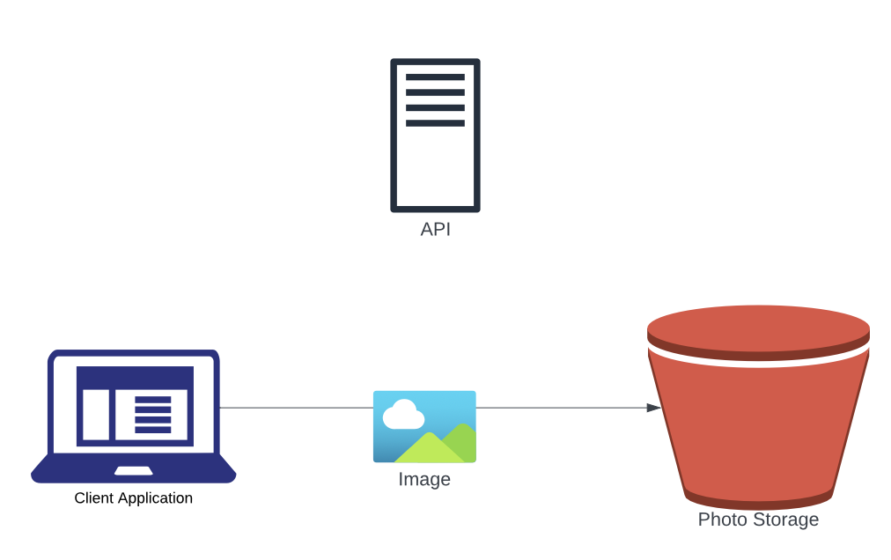
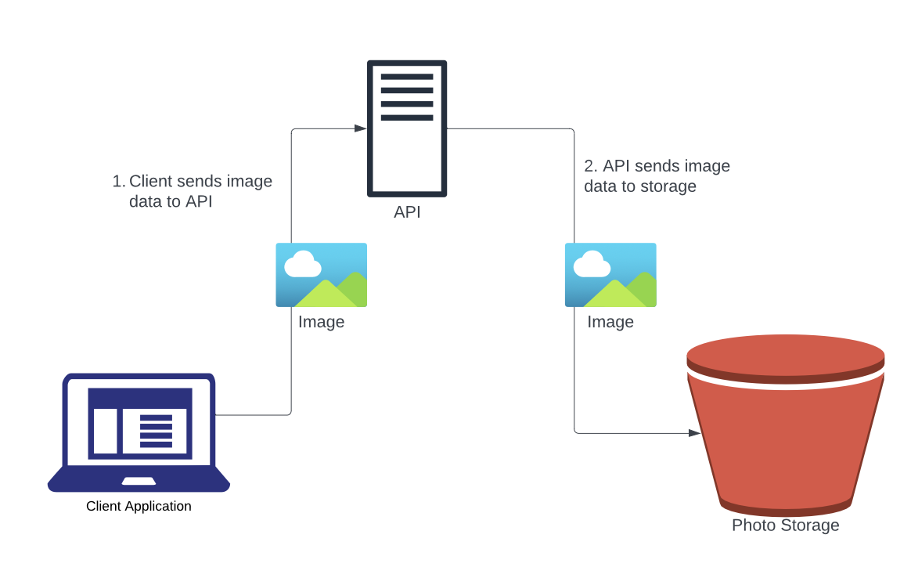
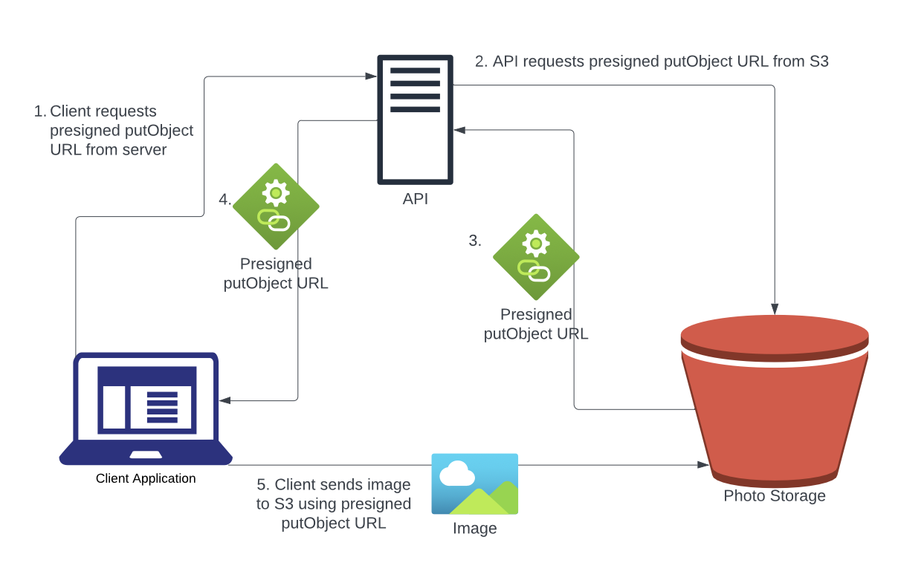
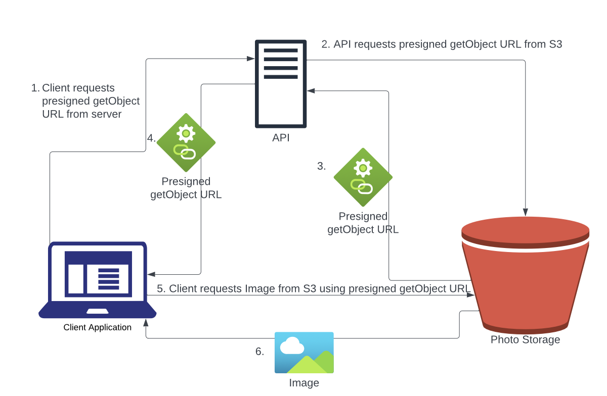

# Easy-Store: A Photo Upload and Download Microservice

## Motivation

In 2022, some classmates and I built a digital disposable camera. We got the idea after noticing how distracted our friends became at social events sharing photos in real time on their phones. To better enable people to experience life in the moment without worrying that their memories might not be preserved, we aimed to combine the quality and ease of digital photography with the deferred gratification of traditional photography and the photo sharing capability of the cloud. On our app, users can form group albums and set “reveal dates” for when the photos will become visible (or get virtually developed, as we like to think of it).

I worked on the backend of the project. One of my main contribution was an architectural design than enables clients to upload photos to an S3 bucket without passing the image data through the API server, thus minimizing the load on the server. This architecture is extremely useful for any web service that requires users to upload photos for display or that serves privately stored images to clients. As a strong believer in microservice architecture, I built a highly portable, open-source, streamlined version of this solution for anyone to integrate into their web dev project.

## Architecture

### The Wrong Way

The simplest way to upload an image from a client application to an S3 bucket would be to send it directly using the AWS API, bypassing any servers. This approach, however, introduces a significant vulnerability, as the client would be authenticated to upload anything to S3 without disclosing it to the server. There would be no way to ensure accurate logging, and giving a client application such permsisions violates the principle of least priveledge.

### A Slight Improvement

Another option is for the client to send the image data to the server, which can perform any necessary logging before sending the image to S3. This approach is much safer but puts a heavy load on the server, as it has to process all image data.

### My Solution

To get the best of both worlds, we combine the two naive approaches. When the client needs to upload an image, they make a request to the server to generate a presigned upload URL. The server, which has permission to write to the S3 bucket, then requests a secure upload URL from the bucket, which it returns to the client. The client then uses this presigned URL to upload their photo directly to S3.

We can leverage the same architecture when the client needs to download an image from S3.

## Advantages

## Usage

## Security Considerations

## Acknowledgements

I would like to thank Alan Moss, Josh Pfefferkorn, Gonza Villalba, and Brendan Berkman for all their work developing Flashback, the digital disposable camera.